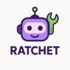

[](https://github.com/dynoinc/ratchet/actions/workflows/build.yml)

AI bot to help reduce operational toil

## Architecture

```
                                  ┌──────────────────┐
                                  │     Slack API    │
                                  └────────┬─────────┘
                                           │
                                  ┌────────▼─────────┐
                                  │ Slack Integration│
                                  └────────┬─────────┘
                                           │
┌──────────────┐                  ┌────────▼─────────┐                ┌──────────────┐
│   OpenAI/    │◄─────────────────┤       Bot        ├───────────────►│  PostgreSQL  │
│   Ollama     │                  │  (Coordinator)   │                │   Database   │
└──────────────┘                  └────────┬─────────┘                └──────────────┘
                                           │
                  ┌────────────────────────┼──────────────────────┐
                  │                        │                      │
          ┌───────▼──────┐         ┌───────▼──────┐         ┌─────▼─────┐
          │   Tools      │         │  Background  │         │    Web    │
          │              │         │   Workers    │         │  Server   │
          └──────┬───────┘         └──────┬───────┘         └───────────┘
                 │                        │
    ┌────────────┴──────────┐   ┌─────────┴──────────────────────────┐
    │  ● channel_monitor    │   │  ● backfill_thread_worker          │
    │  ● classifier         │   │  ● channel_onboard_worker          │
    │  ● documentation      │   │  ● documentation_refresh_worker    │
    │  ● channel reports    │   │                                    │
    │  ● runbooks           │   └────────────────────────────────────┘
    │  ● bot usage          │
    └───────────────────────┘
```

## How AI is Used

As shown in the architecture above, Ratchet sits at the intersection of Slack, LLMs, Tools, and a Database.

When it's added to a public channel in Slack, it starts recording all messages in its database (including some historical
messages as part of onboarding). Now, whenever someone pings `@ratchet ...`, it treats that Slack thread as
a conversation between users and the LLM. It uses the tools (built-in and those added by customers) to respond
in the Slack thread. 

Currently, Ratchet focuses on two aspects of toil:

### Operational toil (-ops channels)

To help deal with on-call issues, Ratchet can classify incoming messages as alerts firing and will try to post a helpful
runbook based on historical triaging of that alert. Additionally, it can post a channel report where it provides
insights on where the team can focus next to reduce operational toil.

### Documentation (-help channels)

Helping users use your systems/services well is a full-time job. Ratchet can integrate with your documentation sources and
try to answer user questions. On top of that, depending on the source, it can also update your documentation based on 
conversations in Slack, which ensures documentation health keeps improving.

For channels where users primarily ask questions, it's probably best to use `@ratchet enable agent mode for this channel`, so
Ratchet will respond to questions without waiting for explicit requests.

## Built with

| Tool                                                  | Purpose                                                        |
|-------------------------------------------------------|----------------------------------------------------------------|
| *Production*                                          |                                                                | 
| [Go](https://go.dev/)                                 | Main programming language for the application                  |
| [Slack](https://slack.com/)                           | Platform for bot interaction and message handling              |
| [PostgreSQL](https://www.postgresql.org/)             | Primary database for storing messages, runbooks and embeddings |
| [SQLc](https://sqlc.dev/)                             | Type-safe SQL query generation from schema                     |
| [Riverqueue](http://riverqueue.com/)                  | Background job processing and scheduling                       |
| [pgvector](https://github.com/pgvector/pgvector)      | Vector database for storing embeddings                         |
| *Development*                                         |                                                                |
| [Ollama](https://ollama.com/)                         | Local LLM inference server                                     |
| [Docker](https://www.docker.com/)                     | Containerization and deployment                                |
| [Github Actions](https://github.com/features/actions) | CI/CD pipeline automation                                      |
| [Cursor](https://www.cursor.com/)                     | IDE for writing code                                           |

## Lessons Learned

* PostgreSQL as database, queue, and vector DB is working out great.
* Slack as a data source seems to be enough to derive value.
    * Though the Slack API is poorly documented and inconsistent.
* Investing in building UI for visibility ended up wasting a lot of time.
    * Even with AI tools, it is hard to get right for a backend engineer.
    * Even after you figure out HTML/CSS/JS, dealing with security concerns and deploying to production is a pain.
    * JSON API on the other hand is great. Just works and you can post-process output with `jq` efficiently.
    * River queue and its UI is great though.
* For database schema, instead of using individual columns for each attribute, using an `attrs` column as jsonb is great.
    * SQLc support for custom types and automatic serialization/deserialization to jsonb is great.
* Given the focus of the bot is on AI, we could have saved time by:
    * Not focusing on non-AI features (like matching open/close incidents manually or building UI).
    * Not aiming for perfect data collection, when AI is good with imperfect data.
* On the AI front:
    * Ollama is great for local development.
    * The qwen2.5:7b model is fast and good enough for local development.
    * Cursor IDE is great for writing code.
    * Using paid models like Claude Sonnet to improve your own prompts does wonders.
    * Giving the LLM as much context as possible (like all historical messages instead of only new ones) helps.
* MCP, tools, agents:
    * Initially we were classifying each user message intent and then running a set of deterministic logic based on that.
    * Instead just exposing all the functionality as tools and letting AI figure out how to proceed is much more powerful.

## Contributing

* To a Slack workspace where you are an admin, add an app using the manifest from `app-manifest.yaml`.
* Get access to a working Slack app/bot token and add it to the `.env` file (which is gitignored) as:

```
  RATCHET_SLACK_APP_TOKEN=xapp-...
  RATCHET_SLACK_BOT_TOKEN=xoxb-...
  RATCHET_CLASSIFIER_INCIDENT_CLASSIFICATION_BINARY=path/to/binary
```

* Install Docker (for PostgreSQL) and Ollama (for local LLM access).
* Start the binary using:

```bash
  go run ./cmd/ratchet --help
  go run ./cmd/ratchet
```

* Onboard a channel where ratchet bot is added and then ask it process a message. Remember you will need
  to onboard again if you want to test it against new messages since in devmode we do not enable Slack socketmode.

```bash
  curl http://localhost:5001/api/channels/ratchet-test/onboard -X POST
  curl http://localhost:5001/api/commands/generate?channel_id=FAKECHANNELID\&ts=1750324493.161329
```